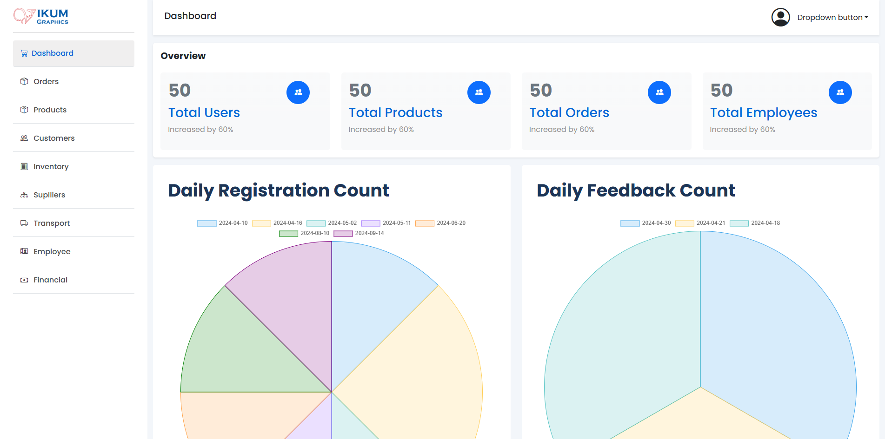
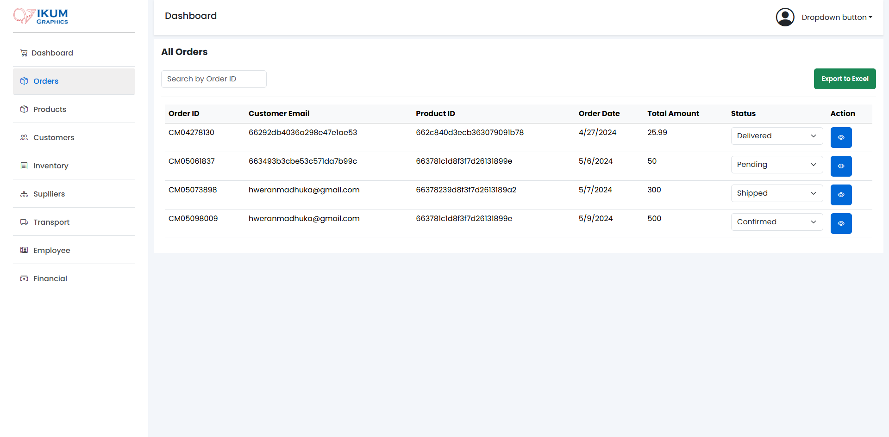
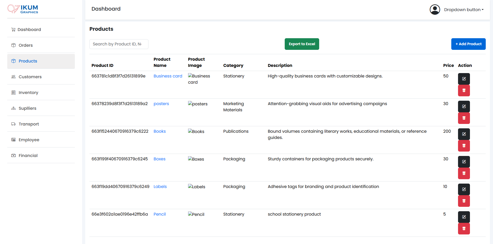
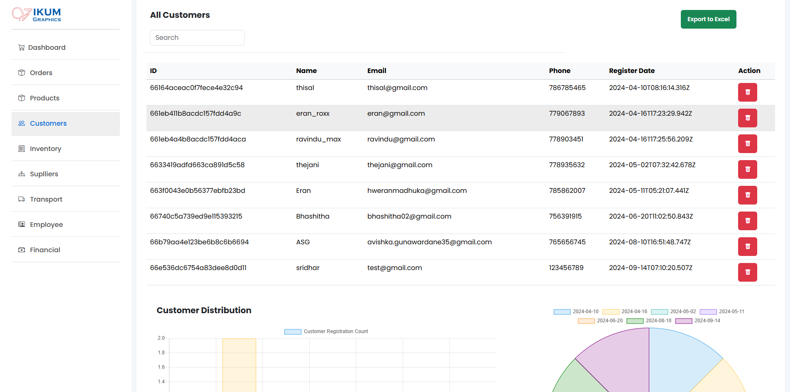
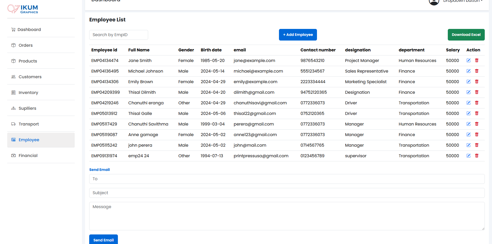
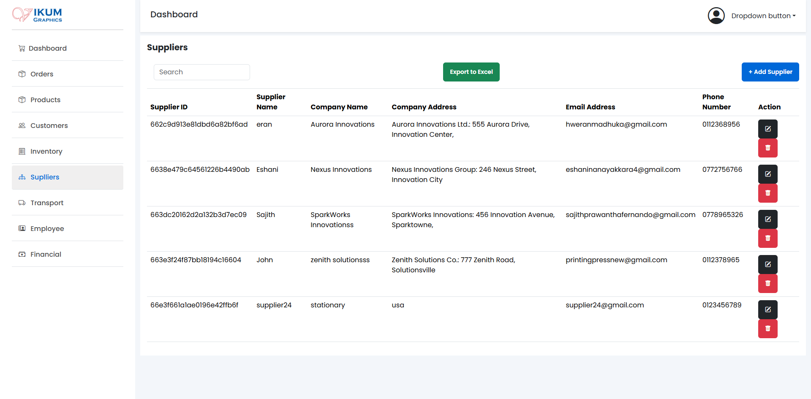
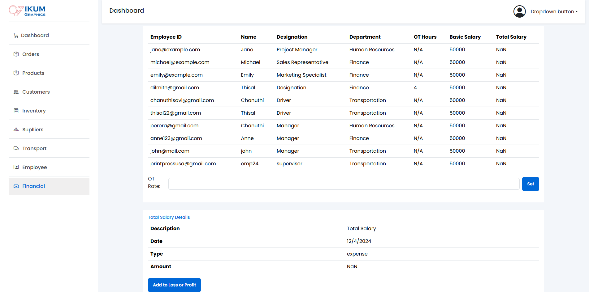

# 🖨️ Printing Press Management System

## Overview
The Printing Press Management System is a comprehensive application designed to streamline printing presses' operations. It provides tools for order management, inventory tracking, financial management, and customer relationship management.

---

## 🌟 Features
- **Order Management**: Easily process and track orders from creation to delivery.
- **Financial Management**: Monitor finances, track expenses, and generate detailed financial reports.
- **Customer Relationship Management (CRM)**: Maintain customer records, track interactions, and manage customer inquiries efficiently.
- **Employee Management**: Keep track of employee details, roles, and performance for smooth team operations.
- **Supplier Management**: Manage supplier information, purchase orders, and supplier relationships seamlessly.
- **Product Management**: Organize product inventory, track stock levels, and manage product details.
- **Transport Management**: Oversee transport operations, assign deliveries, and optimize routes for efficiency.

---

## 🛠️ Technologies Used
- **Frontend**: React.js
- **Backend**: Node.js, Express.js
- **Database**: MongoDB
- **Other Tools**: Mongoose, Axios, Bootstrap

---

## 🔧 Installation
1. Clone the repository:  
   ```bash
   git clone https://github.com/eranmadhuka/PrintingPressManagement.git
   ```
2. Install dependencies for the server:
   ```bash
   cd server && npm install
   ```
3. Install dependencies for the client: 
   ```bash
   cd ../client && npm install
   ```
---

## 🚀 Usage
1. Start the server:  
   ```bash
   cd ../server && npm start
   ```
2. Start the client:
   ```bash
   cd ../client && npm start
   ```
3. Access the application at:
   - http://localhost:3000

---

## 🙌 Contributors

We thank the following people for their contributions to this project:

| Name               | GitHub Profile                          | Role/Contribution                      |
|--------------------|-----------------------------------------|----------------------------------------|
| Eran Madhuka       | [@eranmadhuka](https://github.com/eranmadhuka) | Order Manager  |
| Vikim Bhashitha | [@VikumBhashitha02](https://github.com/VikumBhashitha02)     | Product Manager                   |
| Sajith Fernando | [@SajithPrawanthaFernando](https://github.com/SajithPrawanthaFernando)     | Customer Manager                  |
| Eshani Nanayakkara | [@eshaninanayakkara](https://github.com/eshaninanayakkara)     |Supplier Manager                          |
| Chanuthi Savithma | [@savithmaa](https://github.com/savithmaa)     |Employee Manager                         |
| Thisal | [@thisaldil](https://github.com/thisaldil)     |Transport Manager                          |
| Ravindu Dinuththara | [@ravindusiriwardana](https://github.com/ravindusiriwardana)     |Financial Manager                          |

---

## 📸 Screenshots
<p align="center">
  
  
  
  
  
  
  
  
  
</p>


